# minify — Serverless URL Shortener

A fully serverless URL shortener on AWS: paste a long URL into a single-page
frontend, get a short link back — optionally with your own custom alias and
an expiry — and every visit is a 301 redirect with an atomic click counter
and last-clicked timestamp. No servers, no containers, no maintenance.

## Architecture



## How it works

1. **Shorten** — `POST /shorten` with `{"url": "..."}` (plus optional
   `"alias"` and `"expiresIn"` seconds). The handler validates the URL (must be
   absolute `http(s)`, ≤ 2048 chars) and, when supplied, the alias (3–32 chars
   of letters/digits/`-`/`_`, reserved words like `shorten`/`api` blocked) and
   the expiry (60 s … 365 days). It mints a cryptographically random 7-char id
   — or claims your alias — and writes it to DynamoDB with
   `ConditionExpression="attribute_not_exists(shortId)"` so id collisions can
   never overwrite an existing link; a taken alias returns `409`. An
   `expiresAt` epoch attribute arms DynamoDB TTL so the link self-deletes.
   Returns `{"shortId", "shortUrl"}` (plus `expiresAt` when set).
2. **Redirect** — `GET /{id}` runs a single conditional `UpdateItem` that
   verifies the id exists and is not expired *and* atomically increments
   `clickCount` (`if_not_exists(clickCount, 0) + 1`) while stamping
   `lastClickedAt`, then returns a `301` with the target in the `Location`
   header. Unknown or expired ids get a `404` (expiry is enforced at read
   time, since DynamoDB's TTL sweeper can lag).
3. **Frontend** — static files in `frontend/` served from an S3 website bucket.
   The app calls the API's `/shorten` endpoint (set `API_BASE` in `app.js` after
   deploying), offers optional custom-alias and expiry-picker controls, a
   copy-to-clipboard button, and keeps a small recent-links history in
   `localStorage`.
4. **Throttling** — the HTTP API's default route settings cap traffic at
   10 req/s with a burst of 20, with detailed metrics enabled, so the public
   `/shorten` endpoint can't be abused into a DynamoDB bill.

## Deploy

Prerequisites: AWS CLI configured with credentials, plus the
[SAM CLI](https://docs.aws.amazon.com/serverless-application-model/latest/developerguide/install-sam-cli.html).

```bash
cd url-shortener

# 1. Build and deploy the backend (guided on first run — accept the defaults)
sam build
sam deploy --guided

# 2. Note the ApiEndpoint output, e.g.
#    https://abc123.execute-api.us-east-1.amazonaws.com

# 3. Point the frontend at the API, then upload it
#    (edit frontend/app.js and set API_BASE to the ApiEndpoint)
BUCKET=$(aws cloudformation describe-stacks \
  --stack-name <your-stack-name> \
  --query "Stacks[0].Outputs[?OutputKey=='FrontendBucketName'].OutputValue" \
  --output text)
aws s3 sync frontend/ "s3://$BUCKET/" --delete
```

Tear down with `sam delete` when you're done experimenting.

## Free-tier cost notes

Everything here sits comfortably inside the AWS Free Tier for a portfolio
project:

| Service | Free tier (monthly) | This project |
|---|---|---|
| Lambda | 1M requests + 400k GB-seconds | 128 MB / 10 s functions, tiny usage |
| API Gateway (HTTP) | 1M API calls | a few calls per demo |
| DynamoDB | 25 GB storage, 25 WCU/RCU | on-demand, a few KB of links |
| S3 | 5 GB storage, 20k GETs | three small static files |

Beyond the free tier, cost is effectively pay-per-use pennies.

## Testing

```bash
# unit tests (mocked DynamoDB, no AWS credentials needed)
python -m pytest tests/ -v

# compile check
python -m py_compile src/shorten/app.py src/redirect/app.py

# validate the SAM template before deploying
sam validate --lint
```

CI (`.github/workflows/ci.yml`) runs the pytest suite plus `sam validate`
on every push to `main` and every PR.

End-to-end after deploying:

```bash
API="https://<api-id>.execute-api.<region>.amazonaws.com"

# create a link (custom alias + 7-day expiry shown as options)
curl -s -X POST "$API/shorten" \
  -H 'Content-Type: application/json' \
  -d '{"url": "https://example.com/some/long/path", "alias": "my-link", "expiresIn": 604800}'

# follow it (expect a 301 to the target)
curl -s -o /dev/null -w "%{http_code} -> %{redirect_url}\n" "$API/<shortId>"
```

## Enhancement ideas

- **Per-link stats page** — expose `clickCount`/`lastClickedAt`/`createdAt` via `GET /stats/{id}`.
- **QR codes** — render a QR for each short link in the frontend.
- **Auth** — Cognito authorizer so only you can create links (redirects stay public).

